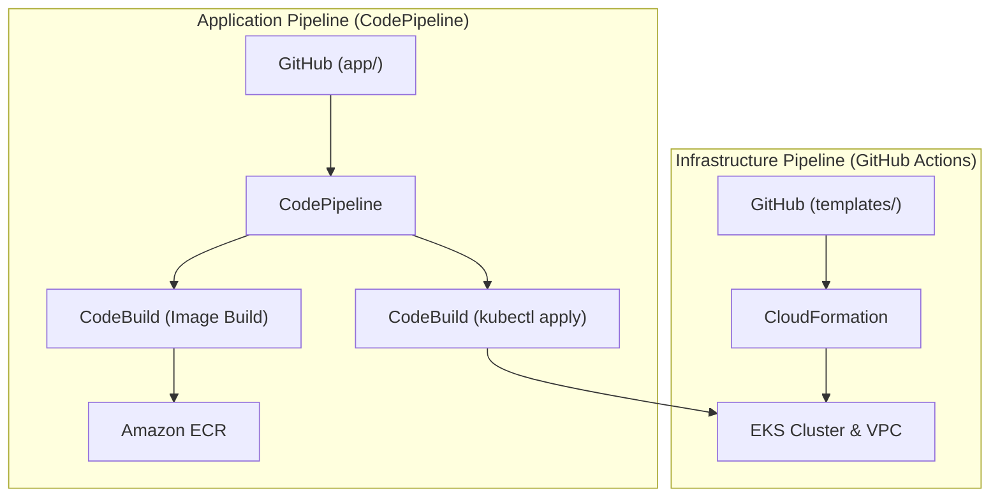

# EKS CI/CD Architecture & Demo Walkthrough

This document serves as a guide for your customer demo, showcasing a production-grade CI/CD pipeline for EKS using AWS native services.

## 1. CI/CD Architecture Optimization: The Two-Pipeline Strategy
For a production-grade demo, we have decoupled Infrastructure and Application deployment.

### Pipeline A: Infrastructure-as-Code (IaC)
- **Tool**: GitHub Actions + CloudFormation.
- **Scope**: VPC, EKS Cluster, IAM Roles, Security Groups.
- **Benefit**: Infrastructure changes are infrequent and higher risk. Isolating them prevents accidental cluster modification during a routine app update.

### Pipeline B: Application CI/CD
- **Tool**: AWS CodePipeline + CodeBuild + EKS.
- **Scope**: Dockerizing code, pushing to ECR, updating K8s manifests.
- **Benefit**: Faster iteration cycles. Developers can deploy code updates without having permissions to modify the underlying EKS infrastructure.



## 2. Technical Questionnaire & Answers

### Q: Explain a CI/CD pipeline you designed using AWS native services.
**Answer:** I designed a pipeline where **GitHub Actions** handles the initial CI (linting, unit tests) and triggers **AWS CodePipeline via OIDC**. CodePipeline orchestrates the containerization using **CodeBuild**, pushes the image to **Amazon ECR**, and finally uses another CodeBuild project to run `kubectl` or `helm` commands to update the EKS cluster. This ensures a clean separation between CI (integration) and CD (delivery).

### Q: How do you design a CI/CD pipeline for multiple environments (dev, test, prod)?
**Answer:** Use a **Branch-per-Environment** or **Environment-per-Stage** strategy in CodePipeline.
- **Dev**: Automated trigger on `develop` branch merge.
- **Test**: Triggered after Dev success; includes automated integration tests.
- **Prod**: Requires a **Manual Approval Stage** in CodePipeline. We use environment-specific configuration files (e.g., `values-dev.yaml`, `values-prod.yaml`) to ensure consistency.

### Q: How do you handle cross-account roles and approvals?
**Answer:**
- **Approvals**: Use CodePipeline's `Manual Approval` action with SNS notifications to stakeholders.
- **Cross-Account**: The Pipeline in the `Shared Services` account assumes a **Cross-Account IAM Role** in the `Target Account` (Dev/Prod). This role has permissions to access EKS and ECR. Artifacts are stored in a centralized S3 bucket with a policy allowing access from all environment accounts.

### Q: How do you implement secure secrets management?
**Answer:** Use **AWS Secrets Manager** for sensitive credentials (DB passwords, API keys) and **SSM Parameter Store** for non-sensitive config.
- **Integration**: CodeBuild pulls secrets at runtime using IAM roles (no hardcoded keys).
- **Rotation**: Secrets Manager supports automatic rotation for RDS and other services.

### Q: Secrets Manager vs SSM Parameter Store?
| Feature | Secrets Manager | SSM Parameter Store |
| :--- | :--- | :--- |
| **Cost** | Paid ($0.40/secret/month) | Free (Standard), Paid (Advanced) |
| **Rotation** | Built-in (Lambda) | Manual/Custom |
| **Complexity** | High (Binary secrets, multi-region) | Simple (Strings, StringLists) |
| **Best For** | DB Credentials, API Keys | App Config, Feature Flags |

### Q: How do you handle rollbacks in AWS CodeDeploy/EKS?
**Answer:**
- **CodeDeploy (ECS/EC2)**: Automatic rollback is triggered if CloudWatch Alarms (e.g., 5xx errors) are breached during deployment.
- **EKS**: Use **Helm** for deployments. `helm rollback <release>` reverts to the previous stable revision. We also use **Liveness/Readiness probes** to prevent bad traffic from hitting failing pods.

### Q: Blue/Green vs Rolling deployments?
- **Rolling**: Updates pods one by one. *Use case:* General apps where small capacity reduction during update is okay.
- **Blue/Green**: Provisions a complete new environment. *Use case:* Mission-critical apps needing zero downtime and instant rollback.

### Q: How do you structure large CloudFormation templates?
**Answer:** Use **Nested Stacks**. Break the system into:
- `vpc.yaml` (Networking)
- `iam.yaml` (Security)
- `eks-cluster.yaml` (Control Plane)
- `node-group.yaml` (Compute)
- `master.yaml` (Orchestrator)
This improves readability, reuse, and bypasses the 200-resource limit per template.

### Q: Explain CloudFormation Drift Detection.
**Answer:** Drift detection identifies if resources have been modified outside of CloudFormation (e.g., via the Management Console).
- **Detection**: 
    - **via Console**: Select Stack > Stack Actions > Detect Drift. Wait for status, then click "View drift results".
    - **via CLI**:
      ```bash
      # Start drift detection
      aws cloudformation detect-stack-drift --stack-name <stack-name>
      
      # Check drift status (using StackDriftDetectionId from above)
      aws cloudformation describe-stack-drift-detection-status --stack-drift-detection-id <id>
      
      # View drift details
      aws cloudformation describe-stack-resource-drifts --stack-name <stack-name>
      ```
- **Remediation**: Either update the template to match the manual change OR manually revert the change in the AWS resource and re-deploy the stack.

### Q: Common CloudFormation failures and fixes?
1. **`ROLLBACK_COMPLETE_CLEANUP_IN_PROGRESS`**: Usually due to IAM permission issues. *Fix:* Check CloudFormation Events and update the IAM Role.
2. **Circular Dependencies**: Resource A needs B, and B needs A. *Fix:* Use `!Ref` or `!GetAtt` carefully or move resources to separate stacks.
3. **Timed Out**: Resource taking too long to create (e.g., EKS cluster). *Fix:* Increase `TimeoutInMinutes` or check underlying logs.

### Q: How do you design a highly available CI/CD pipeline?
**Answer:**
- Deploy CI/CD tools across **Multiple Availability Zones**.
- Use **S3 Versioning** and **Cross-Region Replication** for artifacts.
- Implement **Health Checks** and **Automatic Retries** in CodeBuild steps.

### Q: Compliance and Auditability?
**Answer:**
- **CloudTrail**: Log every API call made by the pipeline.
- **AWS Config**: Monitor resource configurations against compliance rules.
- **CloudFormation Guard**: Pre-deployment policy-as-code linting (e.g., "All S3 buckets must be encrypted").

### Q: How do you implement least-privilege IAM?
**Answer:**
- Use **Task-specific roles** for CodeBuild (only allow access to the specific ECR repo and EKS cluster).
- Use **OIDC for GitHub Actions** instead of permanent Access Keys.
- Periodically review roles using **IAM Access Analyzer**.

### Q: How do you design a highly available CI/CD pipeline for Java applications?
**Answer:** Beyond the pipeline itself, we ensure high availability at the application level in EKS:
1.  **Multi-AZ Deployment**: EKS spreads the Managed Node Group over 3 Availability Zones.
2.  **Pod Anti-Affinity**: We use `podAntiAffinity` rules to ensure that Java pod replicas are not scheduled on the same node. If one node fails, the other replicas remain available.
3.  **Horizontal Pod Autoscaler (HPA)**: Automatically scales the number of pods based on CPU/Memory usage.
4.  **Graceful Shutdown**: Java/Spring Boot is configured for graceful shutdown to ensure in-flight requests are completed before a pod is terminated during a rolling update.
5.  **Health Checks**: Use Spring Boot Actuator `/health` endpoints for Liveness and Readiness probes.

### Q: Compare Secrets Manager vs SSM Parameter Store. (Updated for Java)
**Answer:**
- **Secrets Manager**: Best for DB passwords. Use the **AWS Secrets Store CSI Driver** to mount secrets as a volume. Java apps can then read them as files or property sources.
- **SSM**: Best for `application.properties` overrides.
